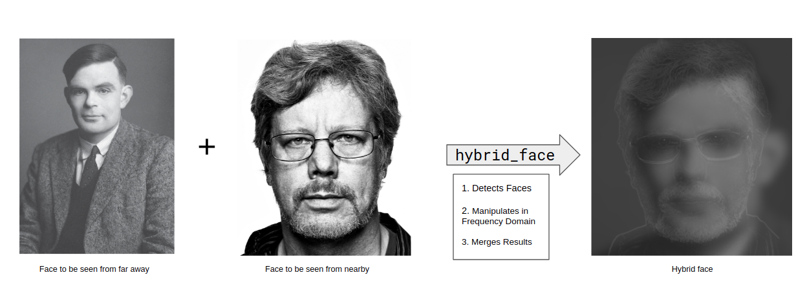

# Hybrid Face

_See one face up close and another from far away!_

## Description


Take any two faces and combine them into a so-called 'hybrid face'. That is, this tool will create an image that looks like the first face from nearby and like the seconds face from far away!
## How does it work?

The core concept comes from research conducted by [A. Oliva et al.](https://stanford.edu/class/ee367/reading/OlivaTorralb_Hybrid_Siggraph06.pdf) that utilised the multiscale processing of images by the human visual system to generate static images with two interpretations.

This tool is an application of the above to faces. This is (roughly) how it works:

1. First we need to understand the concept of the [Fourier Transform](https://www.academia.edu/download/44001876/34957138.pdf) applied to images.

    1.1 Simple (but not easy) explanation: We interpret an image as a [tempered distribution](https://en.wikipedia.org/wiki/Distribution_(mathematics)#Tempered_distributions_and_Fourier_transform) obtained as the sum of [delta distributions](https://en.wikipedia.org/wiki/Dirac_delta_function) shifted by pixel location and multiplied by greyscale value. The Fourier transform of that image is then simply the [Fourier transform](https://en.wikipedia.org/wiki/Fourier_transform) of the aforementioned distribution. Well, technical the [periodically extension](https://www.math.ubc.ca/~feldman/m267/fsExt.pdf) of it.

    1.2 Easy (but not simple) explanation: The Fourier transform of a sound sample gives you the audio frequencies contained in that sample. Similarly, the Fourier transform of an image give you the spatial frequencies that make up that image. A spatial frequency can be interpreted as a periodic wave (i.e. sinusoidal) pattern such that adding up all these waves returns back the (greyscale) image. In particular, high spatial frequencies correspond to rapidly oscillating waves and low spatial frequencies are slowly oscillating waves.

2. It is a [curious observation](https://www.sciencedirect.com/science/article/abs/pii/S0010028597906678) that the human visual system is able to prioritize information coming from particular spatial frequency bands for object or scene recognition. This is precisely what we use in this application. We utilise that fact that from up close, we prioritize high spatial frequencies for object recognition and from further away, we prioritize lower spatial frequencies. Read [here](https://stanford.edu/class/ee367/reading/OlivaTorralb_Hybrid_Siggraph06.pdf) for more details.

3. Finally, with all the above, this tool's functionality can be simply described as: We take the two images, crop them to only have the faces, then in one face we only keep the high spatial frequencies (via convolution with a high-pass filter) and in the other we only keep the low spatial frequencies (via convolution with a low-pass filter) and then we alpha-blend the two faces together.

## How do I use it?

### Setting up the project

Navigate into your fork and do the remaining setup.

```bash
# Setup a python virtual environment:
python3.8 -m venv venv

# update pip
pip install --upgrade pip

# ... and activate it.
. venv/bin/activate
```

This project uses pre-commits, so please make sure to install them:

```bash
# install pre-commit in your venv
pip install pre-commit

# set up pre-commits
pre-commit install

# It is a good idea to update the hooks to the latest version
pre-commit autoupdate

# Run before committing to check all files
pre-commit run --all-files
```

Don't forget to tell your contributors to also install and use pre-commit.

Note: pre-commit hooks run on git commits and if they fix or make you fix some file, then you'll have to commit again.

After this, you should go through all config files and folder names and set them up to your liking, e.g. remove `sst-python-boilerplate` and substitute it with your new package name.

pre-commit: <http://pre-commit.com/>

## Installing dependencies

Dependencies are categorized and managed using `setup.cfg`.

```bash
# install default dependencies
pip install -e .

# to further install testing dependencies run
pip install -e .[testing]

# to further install dev dependencies like pre-commit, black, flake8 run
pip install -e .[dev]
```
